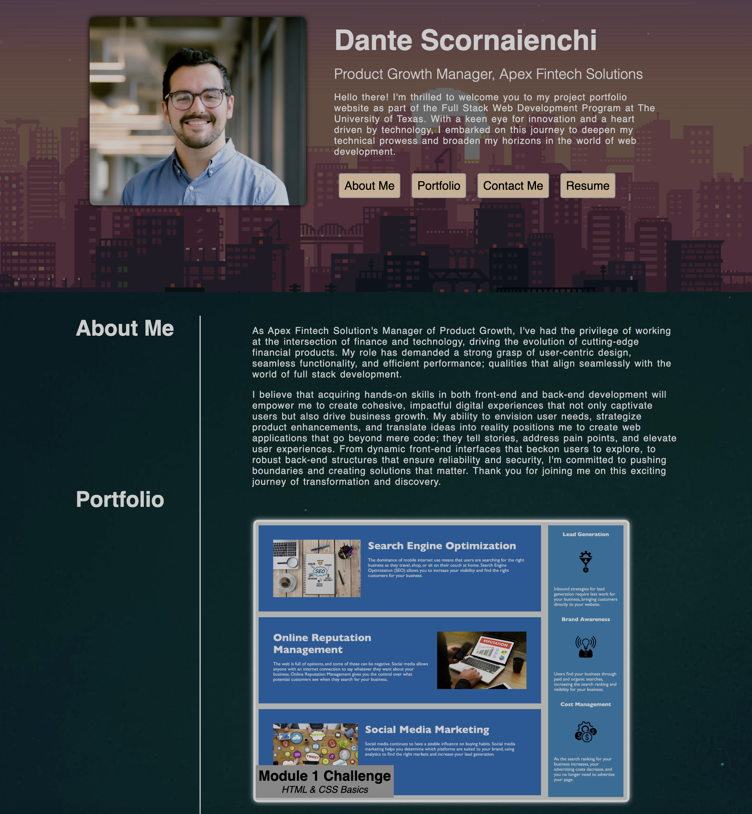

# Dante Scornaienchi's Professional Portfolio

## Description

Welcome to my developer portfolio readme. I'm thrilled to share my previous work and experiences with you. This readme will guide you through the various sections of my portfolio, ensuring you can navigate and explore with ease. 

* About Me: As you explore, you'll notice that I've showcased my name along with a recent photo or avatar, allowing you to put a face to the work. The navigation menu provides links to different sections: "About Me", "My Work", "Contact Me", and "Resume".
* Navigation Links: Feel free to click on any of these links. The UI will smoothly scroll to the corresponding section, providing a seamless experience. 
* About Me Section: I've dedicated a section to share insights about my journey, skills, and background. This should give you a sense of who I am beyond just my work.
* My Work: Here's where you'll get to see what I've been up to. Clicking on the "My Work" link will take you to a gallery of titled images, each representing a different application I've worked on. The first image is intentionally larger to catch your eye.
* Interactive Applications: Excitingly, you can click on any application image to directly explore the deployed version of that application. This hands-on experience allows you to interact and understand my work better.
* Responsive Design: I've designed my portfolio with responsiveness in mind. No matter the device or screen size you're using, the layout will adapt to ensure you have a pleasant journey exploring my work.

## Usage

The website can be found at the URL here: https://dscornaienchi.github.io/professional-portfolio 

The website should look like the screenshot shown below:

## Credits

Some of the assets used on this website are provided by the following 3rd parties: 
* Body background image: https://unsplash.com/photos/iEKg9h5_hd4
* Hero background image: https://wallpapers.com/lo-fi
* Coming soon image: https://encrypted-tbn0.gstatic.com/images?q=tbn:ANd9GcQBfleqqGZxuD2lIrPFwI536Oie1X9LmhdnbRC-0Dme-Vy43aBYGbceec8uag&s 

Tutorials and instruction provided by the University of Texas at Austin Full Stack Web Developement Program and it's affiliated professors and TA's. 

